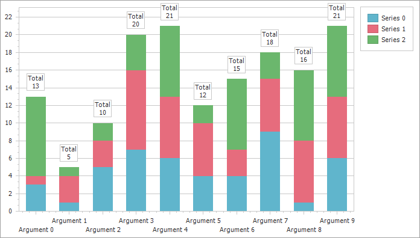
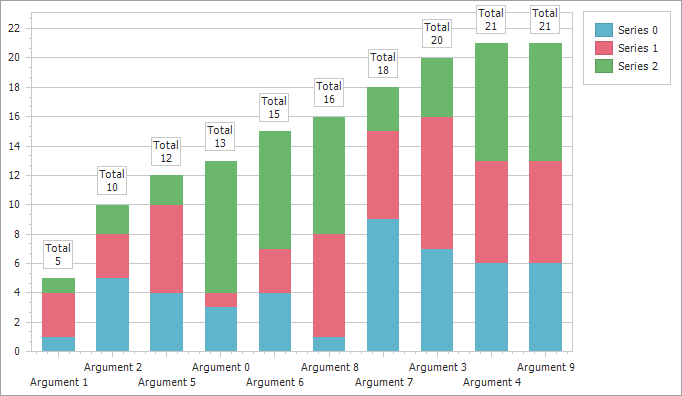

<!-- default badges list -->
[](https://supportcenter.devexpress.com/ticket/details/T585190)
[](https://docs.devexpress.com/GeneralInformation/403183)
[](#does-this-example-address-your-development-requirementsobjectives)
<!-- default badges end -->

# WinForms Chart - Sort Stacked Bars by Total Values using QualitativeScaleComparer

The example sorts X-axis data by totals in a WinForms Chart.

In this example, X-axis displays qualitative values. These values do not have inherent numeric order, they are plotted in the same order as series points in the collection. The example assigns a custom comparer to the [AxisBase.QualitativeScaleComparer](https://docs.devexpress.com/CoreLibraries/DevExpress.XtraCharts.AxisBase.QualitativeScaleComparer) property to sort string values in a custom order: the comparer calculates the total value for each stacked bar and sorts arguments by aggregated values.

## Implementation Details

This example binds the `ChartControl` to a data source created in code. It generated three series, each with ten arguments and random values.



### Create a Custom Comparer

To sort stacked bars by their aggregate values (totals), start by creating a `ArgumentByTotalComparer` class. This class implements the [IComparer](https://learn.microsoft.com/en-us/dotnet/api/system.collections.icomparer) interface.

The comparer sorts arguments based on their total values stored in a dictionary:

```cs
class ArgumentByTotalComparer : IComparer {
    Dictionary<string, double> argTotalDict;

    public ArgumentByTotalComparer(Dictionary<string, double> argTotalDict) {
        this.argTotalDict = argTotalDict;
    }
    public int Compare(object x, object y) {
        return argTotalDict[(string)x].CompareTo(argTotalDict[(string)y]);
    }
}
```

### Calculate Totals for Stacked Bars

The `GetTotalByArg` custom method calculates the sum (the total) for each category by iterating through all series points.

```cs
double GetTotalByArg(object arg) {
    double total = 0;
    foreach (Series series in chartControl1.Series)
        foreach (SeriesPoint point in series.Points)
            if (Equals(point.Argument, arg))
                total += point.Values[0];
    return total;
}
```


### Assign the Custom Comparer to the Chart's X-Axis

Handle the [ChartControl.BoundDataChanged](https://docs.devexpress.com/WindowsForms/DevExpress.XtraCharts.ChartControl.BoundDataChanged) event. This event fired after the chart is bound to the data source and generates series points. In the event handler you can calculate totals and other aggregations based on the loaded chart data.

In the event handler, do the following:

- Call the `GetTotalByArg` method for each argument from the series point to create a new dictionary with totals based on chart values.
- Pass the created dictionary as a parameter for the `ArgumentByTotalComparer` constructor. 
- Assign the comparer to the chart's qualitative axis ([AxisBase.QualitativeScaleComparer](https://docs.devexpress.com/CoreLibraries/DevExpress.XtraCharts.AxisBase.QualitativeScaleComparer)). 

```cs
public partial class Form1 : Form {
    // ...
    void ChartControl1_BoundDataChanged(object sender, EventArgs e) {
        Series series = chartControl1.Series[0];
        var argTotalDict = new Dictionary<string, double>();
        for (int i = 0; i < ArgumentNumber; i++) {
            string argument = series.Points[i].Argument;
            double total = GetTotalByArg(argument);
            argTotalDict.Add(argument, total);
        }
        AxisX axisX = ((XYDiagram)chartControl1.Diagram).AxisX;
        axisX.QualitativeScaleComparer = new ArgumentByTotalComparer(argTotalDict);
    }

}
```

As a result, the chart displays categories ordered by their total values.



## Files to Review

* [Form1.cs](./CS/Form1.cs) (VB: [Form1.vb](./VB/Form1.vb))

## Documentation

* [AxisBase.QualitativeScaleComparer](https://docs.devexpress.com/CoreLibraries/DevExpress.XtraCharts.AxisBase.QualitativeScaleComparer)
* [ChartControl.BoundDataChanged](https://docs.devexpress.com/WindowsForms/DevExpress.XtraCharts.ChartControl.BoundDataChanged)
* [Charts - Sorting Data](https://docs.devexpress.com/WindowsForms/6173/controls-and-libraries/chart-control/data-representation/sorting-data)
* [Reorder Qualitative Axis Values](https://docs.devexpress.com/WindowsForms/5799/controls-and-libraries/chart-control/axes/axis-scale-types#reorder-qualitative-axis-values)

<!-- feedback -->
## Does this example address your development requirements/objectives?

[](https://www.devexpress.com/support/examples/survey.xml?utm_source=github&utm_campaign=winforms-charts-sort-stacked-bars-by-total-values-with-qualitativescalecomparer&~~~was_helpful=yes) [](https://www.devexpress.com/support/examples/survey.xml?utm_source=github&utm_campaign=winforms-charts-sort-stacked-bars-by-total-values-with-qualitativescalecomparer&~~~was_helpful=no)

(you will be redirected to DevExpress.com to submit your response)
<!-- feedback end -->
